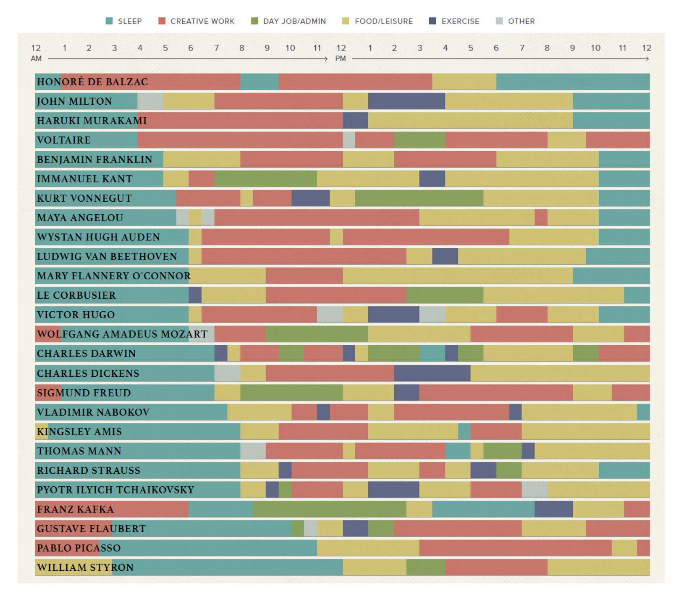

<h1 align=center> A Critique on exsisting visualization on The Daily Routines of Famous Creative People</h1>

-----

**Name: Shaifali Vashistha**

**Reference URL: https://www.visualcapitalist.com/visualizing-the-daily-routines-of-famous-creative-people/** 

Aim of the visualization:

The visualization aims to provide insights into the habits and routines of successful and creative individuals. By presenting this information in a visual format, it makes it easier to understand and compare the patterns and similarities among different individuals and can provide inspiration and guidance for others looking to improve their own daily routines.

#### What Works Well?

- Clear and concise information: The visualization is presenting information in an easily digestible format as a timeline, that is easy to understand and interpret.

- Use of color and graphics: The visualization is well-designed as it uses color and graphics effectively to highlight key information and make the data more visually appealing.

- Sufficient detail: The visualization is providing enough detail about each celebrities' routine so that readers can gain a deep understanding of their habits and strategies.

#### What doesn't work well?

- Overcrowding: Too much information is making the visualization cluttered and difficult to interpret for the reader.
- Lack of context: Without proper context, it is challenging to understand the significance of the information being presented.
- Inaccurate or outdated data: The information presented in the visualization might be accurate and outdated as the provided information is not updated recently.

#### What could be better?

The betterment of the visualization is possible by:

- reducing the overcrowding or using a better format of visualization such as a table.
- providing a proper context to the readers for which the data visualization is done.
- making time-to-time updates of the data and removing outdated data from the visualization to prevent misinterpretation.
