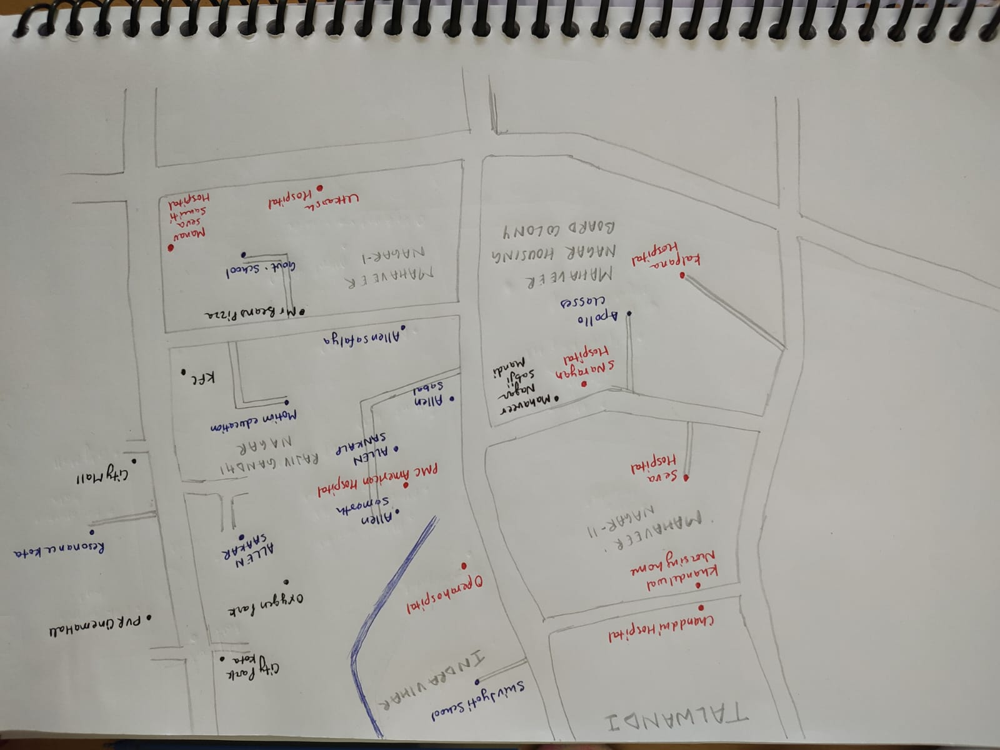
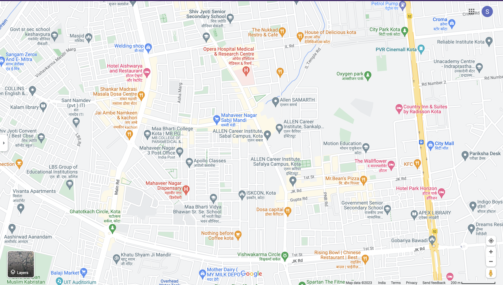
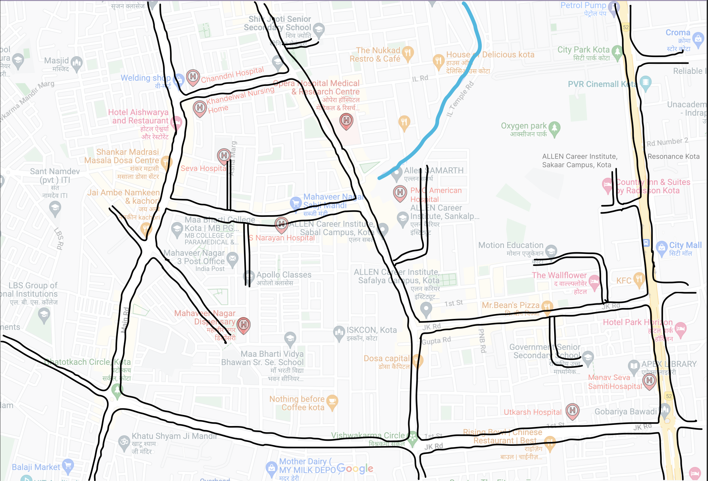
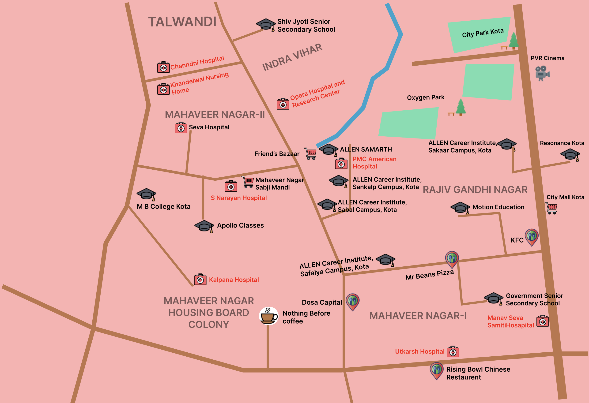

<h1 align=center> A Critique on exsisting visualization on The Daily Routines of Famous Creative People</h1>

-----

**Name: Shaifali Vashistha**

### Location:
Mahaveer Nagar, Rajiv Gandhi Nagar, Indra Vihar, and Talwandi Area in Kota

### Audience:
Visitors, Students who came to study, and their families who are new to Kota.

### Purpose
Kota is a city located in the southeast of the northern Indian state of Rajasthan. It is a major coaching hub of the country for competitive examination preparations and has a number of engineering and medical coaching institutes. The presented map area covers important educational institutes and their surroundings.

### Mental Model Sketch
Below is the Rough Sketch of the locality near the educational institutes.

### Actual Google Map Of the location

### Tracing Relevant Aspects of the locality with Google maps

### Abstractions
 
Abstractions of the visualization after tracing it with google maps.

.png)

After further abstraction

.png)

### Final Schematic Map

Below is the final schematic view of the traced area for the audience.

