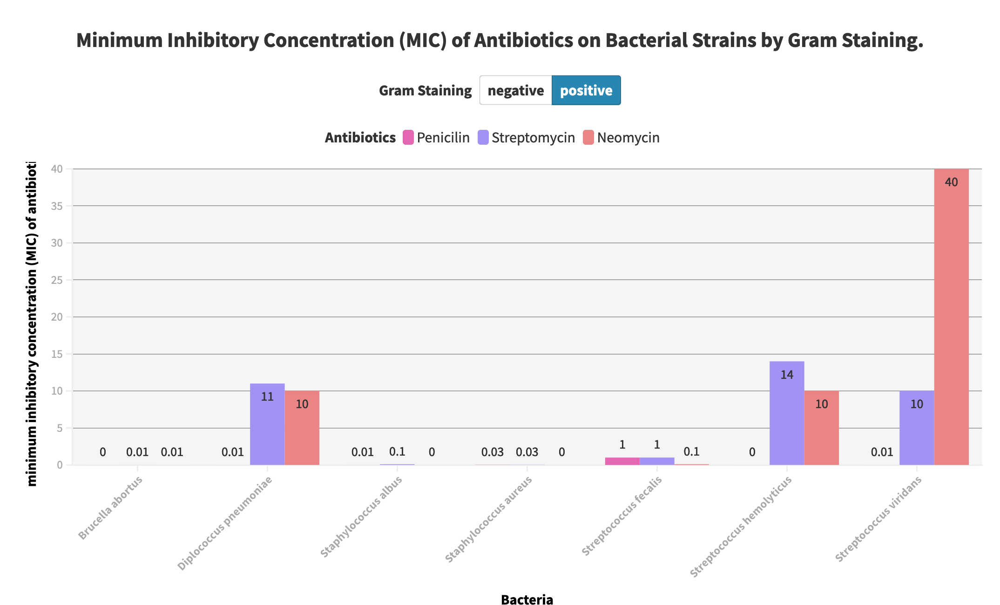
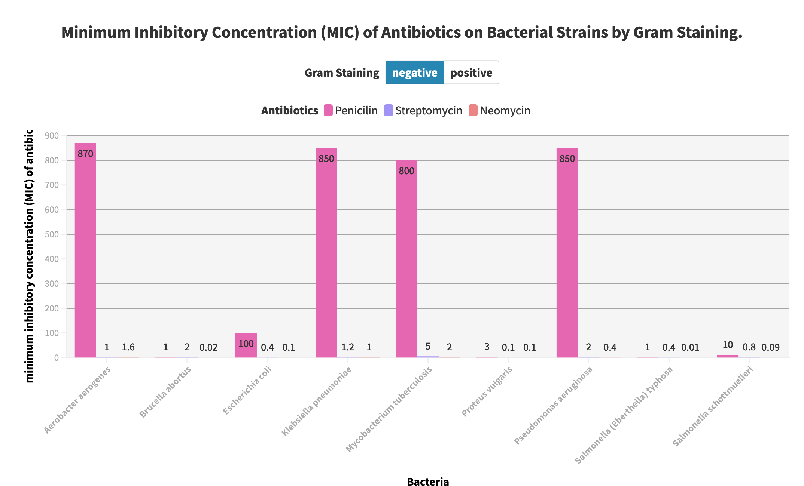

**Name : Shaifali Vashistha**

**Link to Vizualizarion: [Minimum Inhibitory Concentration (MIC) of Antibiotics on Bacterial Strains by Gram Staining](https://public.flourish.studio/visualisation/12950622/)**

### Design Decision:

Based on the dataset, I designed a grouped bar chart to effectively communicate the minimum inhibitory concentration (MIC) of three popular antibiotics (Penicillin, Streptomycin, and Neomycin) on 16 different bacterial strains, grouped by their Antibiotics used on them. The chart is titled "Minimum Inhibitory Concentration (MIC) of Antibiotics on Bacterial Strains by Gram Staining." The choice of a grouped bar chart is appropriate because it allows the comparison of the MIC values of the three antibiotics on each bacterial strain, while also providing an easy comparison between three antibiotics Penicillin, streptomycin, and Neomycin.

### Legends, Annotation, Visual encoding, and coloring of the visualization:

The chart has the Bacteria names on the x-axis, and the MIC values on the y-axis, with the Gram staining variable represented by a switch present above the visualization. The bars are colored pink for Penicillin, Violet for Streptomycin, and peach for Neomycin antibiotic The bars are labeled with MIC values to facilitate easy comparison and interpretation of the effectiveness of the antibiotics against the different bacterial strains. The color encoding of the bars also makes it easy to identify which antibiotic is Penicillin, which is Streptomycin, and which is Neomycin, without requiring the reader to refer to a legend. For better differentiation the switch between Gram-negative and Gram-positive bacteria is present.

### Observations:
The chart clearly shows that Penicillin is most effective against Gram-positive bacteria, while Streptomycin and Neomycin are more effective against Gram-negative bacteria.

### Possible Drawbacks of the Visualization:

However, the chart design may obscure some details such as the actual MIC values of each antibiotic used on bacteria. Therefore, the chart may not be suitable for readers who need detailed information on the specific MIC values for each Antibiotic. Overall, the chart design effectively communicates the relative effectiveness of the two different bacterial strains grouped by antibiotics used on them.

### Tools used:

- MS Excel
- Flourish
